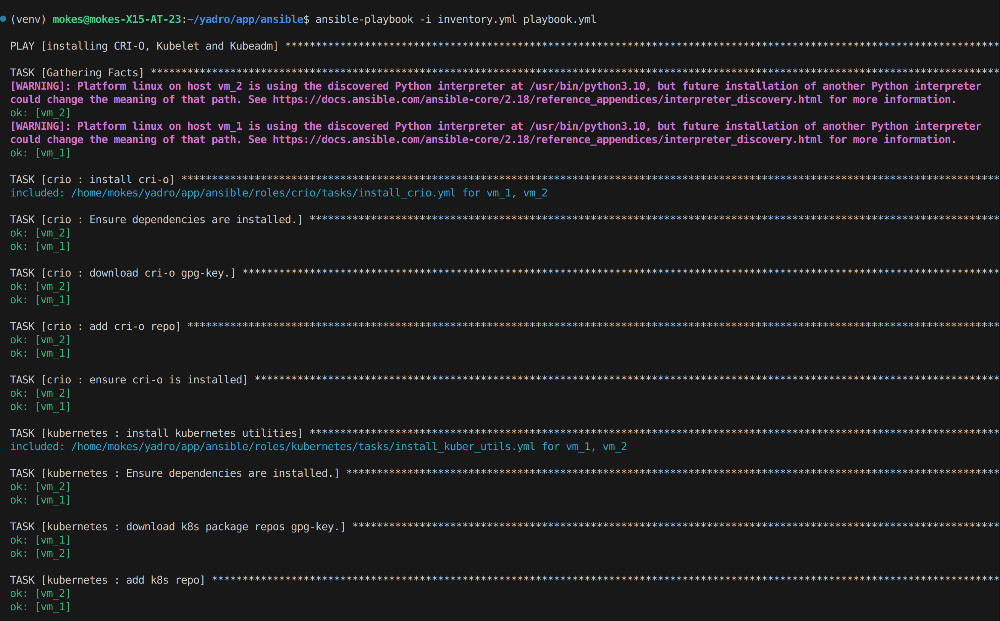
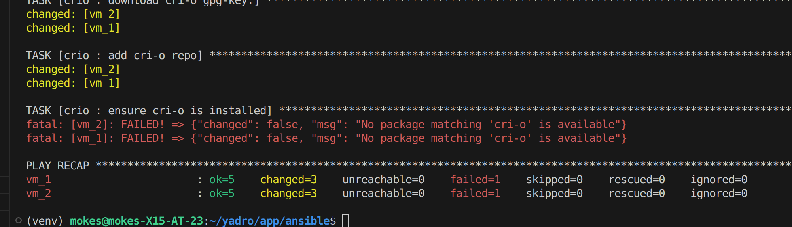

# Интеграция Ansible в проект

Этот документ описывает процесс создания Ansible playbook, который устанавливает сервис cri-o и утилиты Kubernetes на 2 предоставленные виртуальные машины.

## Ход создания playbook

### 1. Создание ключей для доступа к виртуальным машиныам

### 2. Установка Ansible на своё устройство

### 3. Создание директории Ansible и шаблонов ролей командой ```ansible-galaxy init```

### 4. Написание ролей

### 5. Написание плейбука, инвенторя

### 6. Проверка написанного кода линтером Ansible

### 7. Запуск плейбука командой ```ansible-playbook -i inventory.yml playbook.yml```

Результат выполнения плейбука:



**Автор** MaximAntropov
