# Организация кластера Kubernetes

Этот документ описывает процесс создания кластера Kubernetes, с использованием CNI плагина Calico.

## Ход создания playbook

### 1. Установка утилиты kubectl на мастер ноду

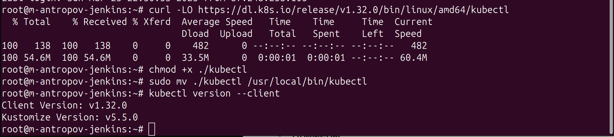

### 2. Разрешаем маршрутизацию IPv4 трафика, настроиваем возможность iptables видеть трафик, передаваемый в режиме моста, а также отключаем файлы подкачки

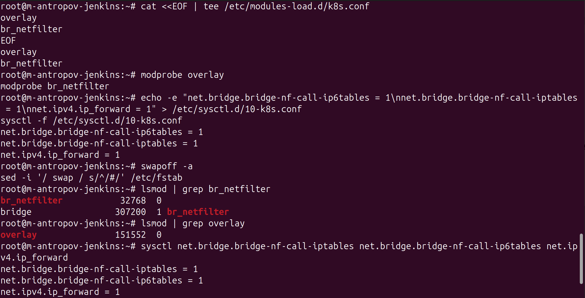

### 3. Проверка запуска cri-o и kubeadm на всех нодах

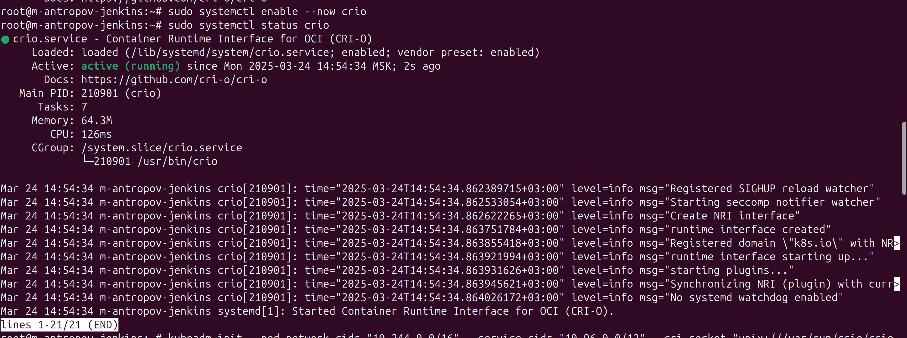

### 4. Командой ```kubeadm init --pod-network-cidr "10.244.0.0/16" --service-cidr "10.96.0.0/12"``` инициализируем кластер

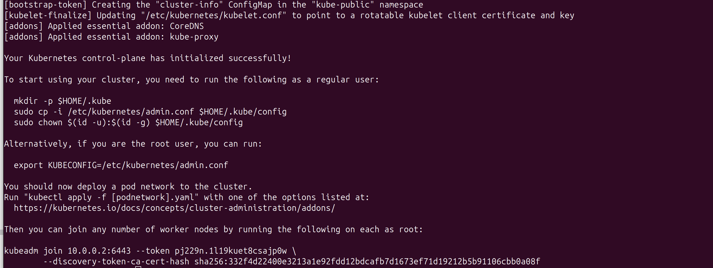

### 5. Конфигурируем kubectl


### 6. Присоединяем воркер ноды к кластеру

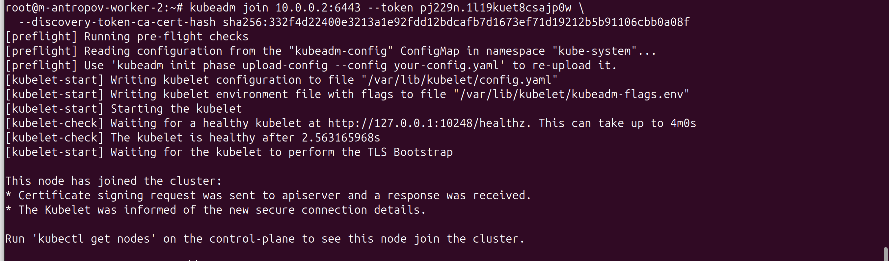

### 7. Устанавливаем сетевой плагин

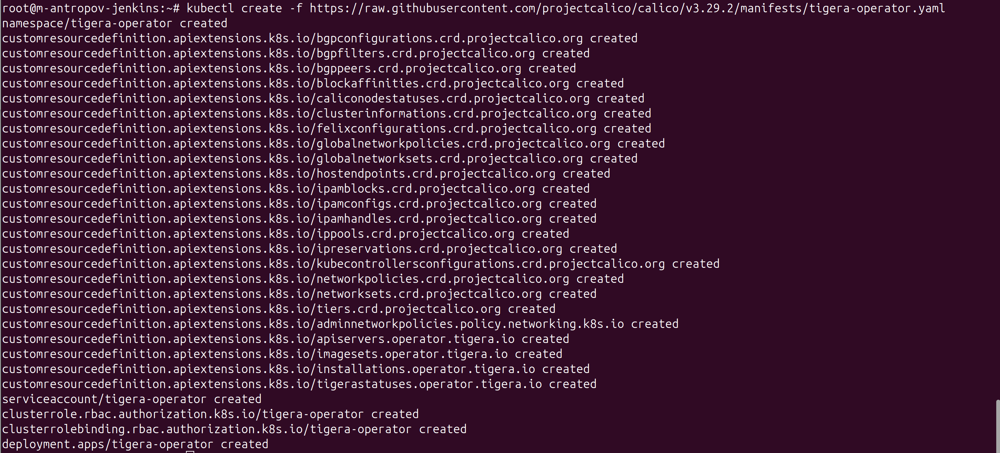
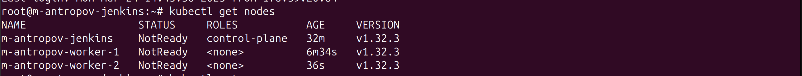
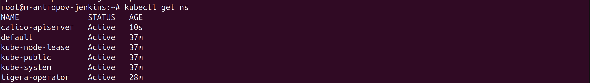

### 8. Скачиваем необходимый пользовательский ресурс и изменяем его

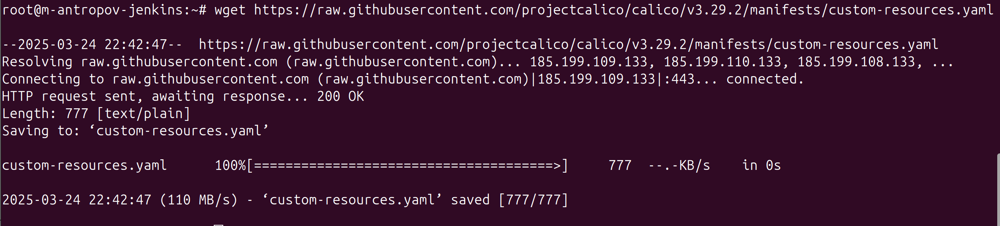
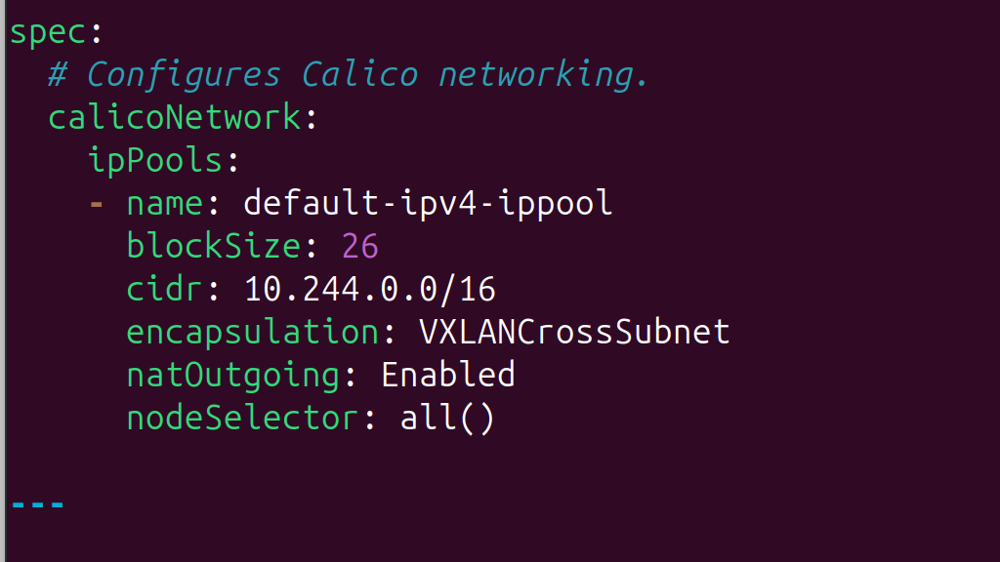

### 9. Изменяем конфигурацию cri-o на всех нодах, чтобы избежать проблемы с запретом на ping пода

Создаем файл конфигурации и прописываем:
```
[crio.runtime]

default_capabilities = [

   "CHOWN",

   "DAC_OVERRIDE",

   "FOWNER",

   "FSETID",

   "KILL",

   "SETGID",

   "SETUID",

   "SETPCAP",

   "NET_BIND_SERVICE",

   "NET_RAW"

]
```
Перезапускаем службу командой ```systemctl restart crio.service```

### 10. Запускаем под и пингуем

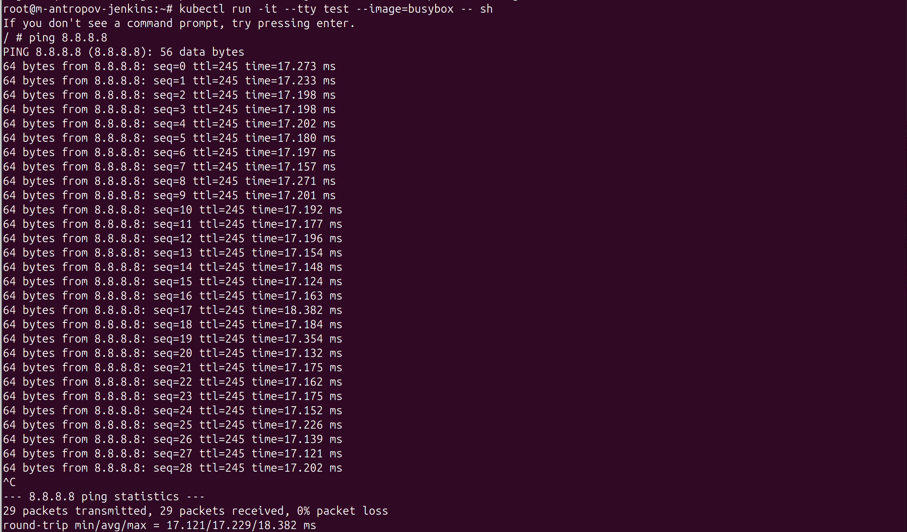

**Автор** MaximAntropov
